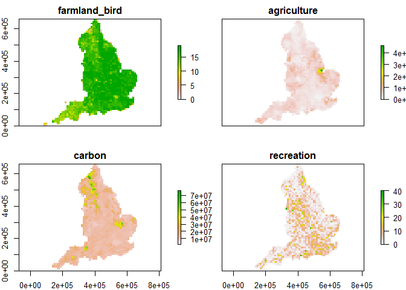
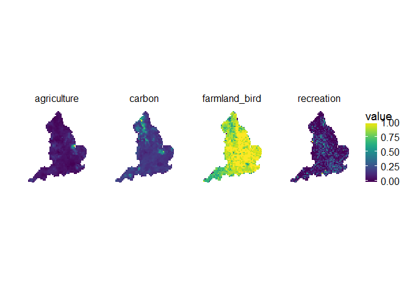

# Data Collation


# Boundary data

First, we need data on boundaries. We are analysing for England because this is the area for which we have a full dataset (recreation data only cover England). Therefore we need the boundary for England, which comes from the [GADM database](www.gadm.org). Additionally, all data are at 10 km x 10 km resolution and in the British National Grid projection. Therefore, we also need the BNG 10km tiles, from Edina Digimap (GB National Grid Squares [SHAPE geospatial data], Scale 1:250000, Tiles: GB, Updated: 1 December 2012, Ordnance Survey (GB), Using: EDINA Digimap Ordnance Survey Service, <http://digimap.edina.ac.uk>, Downloaded: 2017-05-24 15:02:22.222). We convert the BNG 10 km x 10 km data to grid for ease of comparison with other data sets. 


```r
gb_shp <- readOGR("data/gb_shapefile", "GBR_adm1")
```

```
## OGR data source with driver: ESRI Shapefile 
## Source: "data/gb_shapefile", layer: "GBR_adm1"
## with 4 features
## It has 12 fields
```

```r
eng_shp <- subset(gb_shp, NAME_1 == "England")

# all datasets are based on BNG 10km grid - load it in and clip to England
grid_10km <- readOGR("data/bng", "10km_grid_region", verbose = FALSE)

# GB shapefile was WGS84, grids (and everything else) is BNG
eng_shp <- spTransform(eng_shp, proj4string(grid_10km))

# crop 10km data down to England only
grid_10km <- grid_10km[eng_shp,]

# create raster from 10km shapefile
centroids <- gCentroid(grid_10km, byid = TRUE)
grid_df <- grid_10km@data
coordinates(grid_df) <- round(centroids@coords, 0)
gridded(grid_df) <- TRUE
```

```
## Warning in points2grid(points, tolerance, round): grid has empty column/
## rows in dimension 1
```

```r
grid_raster <- raster(grid_df)
```

This document tracks the data loading and collation for the four ecosystem services being modelled in this project: famland birds, recreation day visits, carbon storage and agricultural output. 

## Farmland birds

We obtained species richness data for the 19 species which are on the [RSPB farmland bird indicator list](https://www.rspb.org.uk/our-work/conservation/conservation-and-sustainability/farming/whyfarming/whyfarming/fbi/). BTO Second Breeding Bird Atlas  data were downloaded using the [National Biodiversity Network Atlas](https://nbnatlas.org/). We calculate species richness for each 10 km x 10 km cell and then convert to raster.  


```r
files <- list.files("data/farmland_birds/", full.names = TRUE)

# read in and get species richness per 10km square
bird_dat <- ldply(files, function(f) read.csv(unz(f, "data.csv"))) %>%
  group_by(grid._.ref) %>%
  summarise(sp_rich = length(unique(Matched.Scientific.Name)))

# match to England 10km squares and rasterise
bird_dat <- merge(grid_df, bird_dat, by.x = "TILE_NAME", by.y = "grid._.ref")
bird_dat@data[is.na(bird_dat@data)] <- 0
bird_dat <- rasterize(bird_dat, grid_raster, "sp_rich")
```

## Carbon and agriculture 

Carbon (soil and vegetation carbon) and agriculture data were obtained from Eigenbrod et al. 2009. We load and convert to a raster to match the BNG 10km x 10 km.


```r
# load and rasterise shapefile containing carbon and agriculture data
car_ag_dat <- readOGR("data/carbon_ag", "CarbAgInf_10kmMaster", verbose = FALSE)
proj4string(car_ag_dat) <- proj4string(grid_10km)
car_ag_dat <- car_ag_dat[eng_shp,]
carb_dat <- rasterize(car_ag_dat, grid_raster, "Carb_10km")
ag_dat <- rasterize(car_ag_dat, grid_raster, "Ag_10km")
```

## Recreation

Recreation data represent day visits from the ELVS dataset (number of trips per grid cell) and are those data used by Eigenbrod et al. 2009. We load and convert to a raster to match the BNG 10km x 10 km.


```r
#load and rasterise shapefile containing recreation data
rec_dat <- readOGR("data/rec", "RecPop_10kmHighDensity", verbose = FALSE)
proj4string(rec_dat) <- proj4string(grid_10km)
rec_dat <- rec_dat[eng_shp,]
rec_dat <- rasterize(rec_dat, grid_raster, "TripCount_")
```

## Bringing it all together

Create a raster stack and a .csv file with the data and save for later use.


```r
# combine data into a raster stack for immediate plotting
full_dat <- stack(bird_dat, ag_dat, carb_dat, rec_dat)
names(full_dat) <- c("farmland_bird", "agriculture", "carbon", "recreation")
plot(full_dat)
```

<!-- -->

```r
writeRaster(full_dat, "data/ES_values.grd", format="raster", overwrite = TRUE)

# also useful to have the data in a dataframe - for analysis and pretty plotting (e.g. in ggplot2). 
es_dat <- as.data.frame(full_dat, xy=TRUE)
es_dat <- filter(es_dat, !is.na(farmland_bird) & !is.na(agriculture) & !is.na(carbon) & !is.na(recreation))
save(es_dat, file="data/es_values.rda")
```


The data can now be scaled so as to be comparable for analysis and plotting. 


```r
scale <- function(x) (x-min(x))/(max(x)-min(x))

es_dat_scaled <- mutate(es_dat, 
                        farmland_bird = scale(farmland_bird),
                        agriculture = scale(agriculture),
                        carbon = scale(carbon),
                        recreation = scale(recreation)) %>%
  gather(service, value, -x, -y)

ggplot(es_dat_scaled, aes(x = x, y = y, fill = value)) + 
  geom_raster() + 
  scale_fill_viridis() + 
  facet_wrap(~service, nrow = 1) + 
  coord_equal() + 
  scale_x_continuous(name = "") + 
  scale_y_continuous(name = "") + 
  theme(strip.background = element_blank(), panel.spacing = unit(2, "lines"), axis.ticks=element_blank(), axis.text=element_blank(), axis.line=element_blank())
```

<!-- -->
